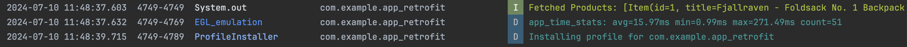
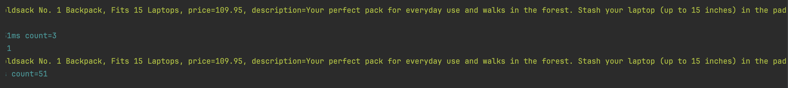

## Retrofit and API Calls:
The application fetches product data from the https://fakestoreapi.com/products. This is achieved by making an API call using the Retrofit library, which handles the network request and response. The data fetched from the API is displayed in the app's UI when the "Fetch Products" button is pressed.

## RESTful Services and URIs:
- REST (REpresentational State Transfer) is a stateless web architecture used by many web services.
- Requests are made to RESTful web services via Uniform Resource Identifiers (URIs), which identify a resource on the server.

## HTTP Methods:
- Each web service request contains a URI and is transferred using HTTP.
- Common HTTP operations include:
  - `GET`: Retrieve server data.
  - `POST`: Create new data on the server.
  - `PUT`: Update existing data on the server.
  - `DELETE`: Delete data from the server.
- Example URIs for the Fake Store API:
  - List of products: `https://fakestoreapi.com/products`
  
## JSON Format:
- JSON (JavaScript Object Notation) represents structured data in key-value pairs and is commonly used for server responses.

## Retrofit Library:
- Retrofit is a third-party library for communicating with RESTful web services. It is used to communicate with the backend server by providing URIs for the web service.

### Preview of Logcat after fetching data:
   

